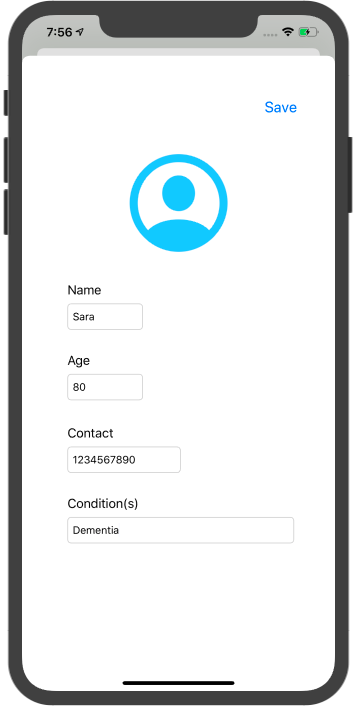
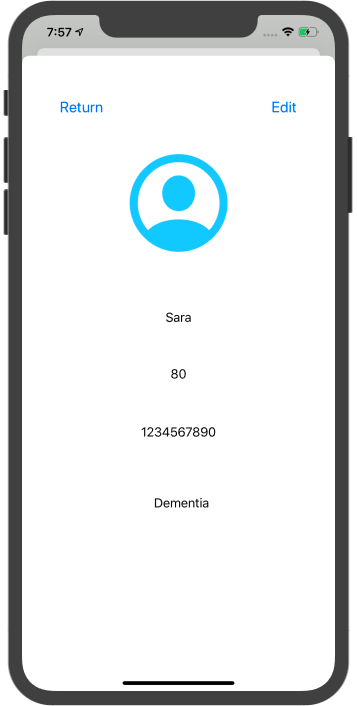
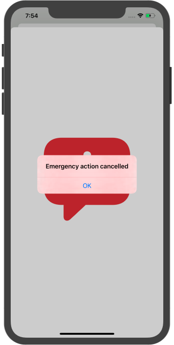

# Helderly

Team: Abby Lu (@AbbyLuHui), Sara Zhao (@gnayiyoahz) , Jerry Zhuang (@JerryZhuang8), Ryan Chen (@ryanywchen)

### Inspiration

According to the US Census Bereau, the elderly population—persons 65 years or older—numbered 52 million in 2018, and approximately 5.6 million are living with Alzheimer's disease in 2019. However, since they are less tech-savvy and might face problems updating their family of their situation, they often cannot receive timely assistance. 

Therefore, we hope to build an app that improves this situation and establishes a better communication system between the elderly and their families in case of emergency.

### What it does

This App aims to provide more timely help to the elderly, especially those with dementia. When an elder person encourters emergency situations, namely 1) **falling** and 2) **getting lost**, their family members will be alerted through text messages using the Twilio API.

1) Falling

​	When the person falls, the app detects it through the phone's gravity sensor and shows an emergency page. 
If he/she does not stand up or long-press the button within 1 minute, a message will be sent to the emergency contact and 911 will be dialed. Otherwise, the action will be cancelled.

 

 

2) Getting lost

​	When setting up the account, an address (location coordinates) and a "safety range" will be entered into the app. If the person goes out of the safety range (e.g. 10 blocks from home address), the emergency contact will be alerted via text message.

Whenever an emergency ocurrs, the elderly user's app shows his personal information including 1) name, 2) Age, 3) Contact and 4) Condition, so that the emergency medical services (EMS) personels can learn about the situation even if the elder user is unable to explain it clearly.

Besides, the real-time location of the user is readily available on the interface, in case the user has any difficulty locating him/herself.

### How we built it
We used Swift to design the iOS application. Moreover, we had a Python-Flask backend that used Twilio to establish communications such as text messages and phone calls. The justification for using a Python-Flask backend is that this backend can store information in a database more efficiently. The Swift application is connected to a GPS locator and a accelerometer to detect changes in location and falls, respectively. When a fall is detected by Swift, Swift sends a request to the Python-Flask backend, which then calls the emergency contact through Twilio. When a GPS location change beyond the boundary is detected, Swift sends a request to the Python-Swift backend which then texts the location of the eldery person to the emergency contact through Twilio. 

### Challenges we ran into
The Python-Flask backend and the Swift frontend were difficult to connect together, as the ports oftentimes did not work. Ultimately, we resolved this issue. A few buttons on the Swift frontend application also was difficult to optimize. Moreover, texts involving a non-shortened Google Maps URL sometimes did not send successfully through Twilio for unknown reasons. We tried our best to fix it, but it appears to still send inconsistently. 

### Accomplishments that we're proud of
Getting the Twilio interface to connect seamlessly to the iOS application was a great achievement, as now a falling accelerometer and a significant location change automatically activate Twilio's communications system. Moreover, we are very happy with the layout of our iOS application and the smoothness of the buttons and options within it. 

### What we learned
We learned a lot about application development and also Twilio and the Python-Flask backend, as well as ways to connect frontend systems with backend systems. 

### What's next for Helderly
We will attempt to create a database for the names entered into the application. Moreover, we can potentially experiment with paid versions of Twilio and increased amounts of phones. 

### Built With

`Swift``iOS``Twilio``python``Flask``Rest API`
